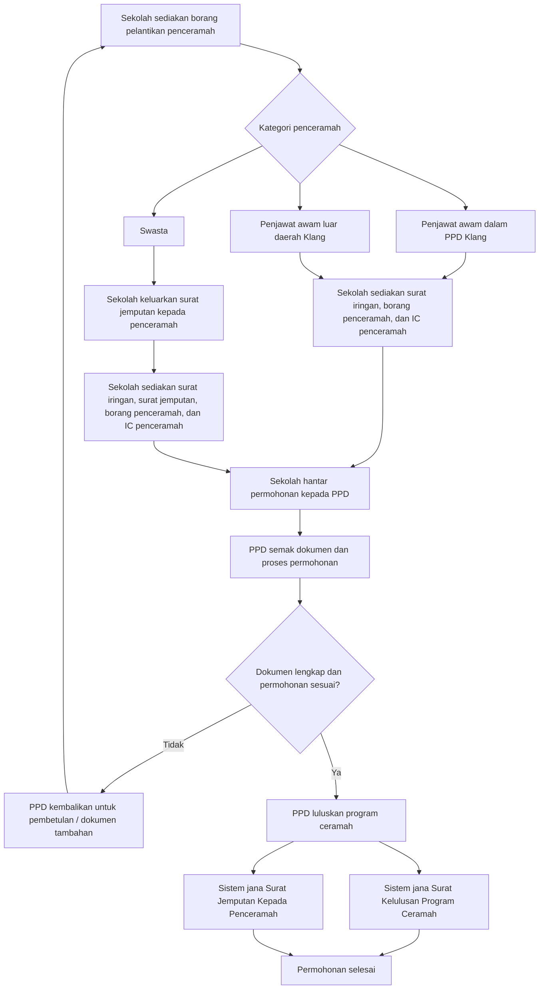

# Flow Chart Kelulusan Penceramah PPD

```mermaid
flowchart TD
    A["Sekolah sediakan borang pelantikan penceramah"] --> B{"Kategori penceramah"}

    B --> C["Penjawat awam dalam PPD Klang"]
    B --> D["Penjawat awam luar daerah Klang"]
    B --> E["Swasta"]

    C --> F["Sekolah sediakan surat iringan, borang penceramah, dan IC penceramah"]
    D --> F
    E --> G["Sekolah keluarkan surat jemputan kepada penceramah"]
    G --> H["Sekolah sediakan surat iringan, surat jemputan, borang penceramah, dan IC penceramah"]

    F --> I["Sekolah hantar permohonan kepada PPD"]
    H --> I

    I --> J["PPD semak dokumen dan proses permohonan"]
    J --> K{"Dokumen lengkap dan permohonan sesuai?"}

    K -->|Tidak| L["PPD kembalikan untuk pembetulan / dokumen tambahan"]
    L --> A

    K -->|Ya| M["PPD luluskan program ceramah"]
    M --> N["Sistem jana Surat Kelulusan Program Ceramah"]
    M --> O["Sistem jana Surat Jemputan Kepada Penceramah"]
    N --> P["Permohonan selesai"]
    O --> P
```
